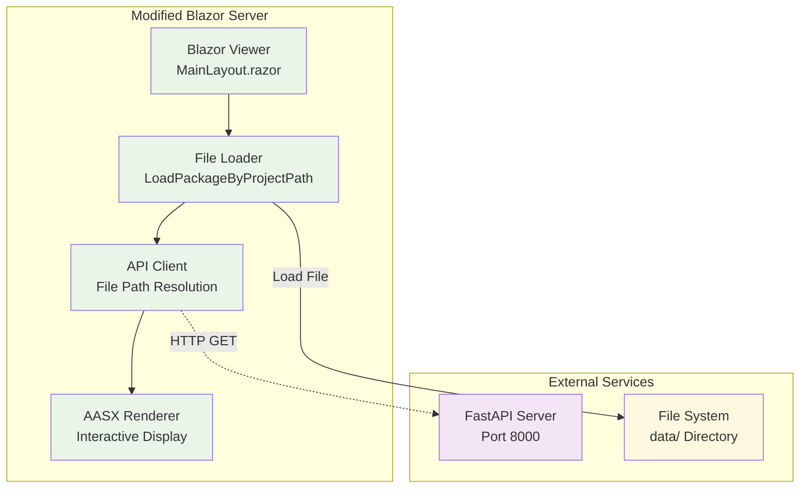

# AASX Blazor Server

## Overview

This is a modified version of the **AASX Package Explorer** Blazor server, originally developed by the [AASX Package Explorer Team](https://github.com/admin-shell-io/aasx-package-explorer). We have adapted and enhanced it to integrate seamlessly with our FastAPI-based AAS data modeling framework.

## Original Project Credits

### Original AASX Package Explorer
- **Original Repository**: [admin-shell-io/aasx-package-explorer](https://github.com/admin-shell-io/aasx-package-explorer)
- **Original License**: Apache License 2.0
- **Original Authors**: AASX Package Explorer Team
- **Original Purpose**: Standalone AASX file viewer and editor

### Our Modifications
We have significantly modified the original AASX Package Explorer to:

1. **Integration with FastAPI**: Added API communication for file path resolution
2. **File ID Support**: Modified to accept file IDs instead of direct file paths
3. **Path Conversion**: Added automatic conversion from logical paths (with spaces) to physical paths (with underscores)
4. **Container Integration**: Optimized for Docker deployment with shared volumes
5. **URL Parameter Handling**: Enhanced to load files via URL parameters

## Architecture

### Modified Components



### Key Modifications

#### 1. **MainLayout.razor**
- **Original**: Loaded files directly from file system
- **Modified**: Added `LoadFileFromUrlParameter()` method for file ID resolution
- **New Features**: 
  - URL parameter parsing (`?file=<file_id>`)
  - API communication for path resolution
  - Automatic path conversion (spaces → underscores)

#### 2. **Program.cs**
- **Original**: `LoadPackageByProjectPath()` expected 2-part paths
- **Modified**: Updated to handle 3-part paths (`useCase/project/filename`)
- **New Features**:
  - Path conversion logic
  - Enhanced error handling
  - Support for logical vs physical paths

#### 3. **AasxFileServerInterfaceService.cs**
- **Original**: Direct file system access
- **Modified**: Added path conversion and validation
- **New Features**:
  - Space-to-underscore conversion
  - 3-part path validation
  - Enhanced error messages

#### 4. **AASXFileServerAPIApi.cs**
- **Original**: Basic file serving
- **Modified**: Enhanced for integration with FastAPI
- **New Features**:
  - Updated path format documentation
  - Improved error handling
  - Better logging

## File Structure

```
server/
├── src/
│   ├── AasxServerBlazor/           # Main Blazor application
│   │   ├── MainLayout.razor        # Modified: URL parameter handling
│   │   └── ...
│   ├── AasxServerStandardBib/      # Core server library
│   │   ├── Program.cs              # Modified: Path handling
│   │   ├── Services/
│   │   │   └── AasxFileServerInterfaceService.cs  # Modified: Path conversion
│   │   └── ...
│   ├── IO.Swagger.Lib.V3/          # API library
│   │   └── Controllers/
│   │       └── AASXFileServerAPIApi.cs  # Modified: Enhanced API
│   ├── jsoncanonicalizer/          # Required dependency
│   ├── es6numberserializer/        # Required dependency
│   └── ...
├── docker/
│   ├── Dockerfile                  # Our custom Dockerfile
│   └── Dockerfile.dev              # Development Dockerfile
├── .github/                        # GitHub workflows (copied from original)
├── README.md                       # This file
└── ...
```

## Setup and Installation

### Prerequisites

- **Docker**: For containerized deployment
- **.NET 6.0+**: For local development
- **FastAPI Server**: Running on port 8000 for file path resolution

### Quick Start

#### Using Docker (Recommended)

```bash
# Build the container
docker build -t aasx-blazor -f docker/Dockerfile .

# Run the container
docker run -p 5001:5001 -v $(pwd)/data:/app/data aasx-blazor
```

#### Local Development

```bash
# Navigate to server directory
cd server

# Restore dependencies
dotnet restore

# Build the project
dotnet build

# Run the server
dotnet run --project src/AasxServerBlazor/AasxServerBlazor.csproj
```

### Environment Variables

```bash
# Required
AASX_DATA_PATH=./data                    # Path to AASX files
AASX_SERVER_PORT=5001                    # Server port

# Optional
AASX_SERVER_HOST=0.0.0.0                # Server host
ASPNETCORE_ENVIRONMENT=Development       # Environment
```

## API Integration

### File Path Resolution

The modified server communicates with the FastAPI server to resolve file IDs:

```csharp
// Example API call
var apiUrl = "http://host.docker.internal:8000/api/aasx/files/{file_id}/path";
var response = await httpClient.GetAsync(apiUrl);
```

### Response Format

```json
{
  "file_id": "b36202d8-b7c3-5adc-ac4b-6508f74ab556",
  "use_case_name": "Industrial Process Optimization",
  "project_name": "Robotic System Design",
  "filename": "Example_AAS_ServoDCMotor_21.aasx",
  "logical_path": "Industrial Process Optimization/Robotic System Design/Example_AAS_ServoDCMotor_21.aasx",
  "physical_path": "data\\Industrial_Process_Optimization\\Robotic_System_Design\\Example_AAS_ServoDCMotor_21.aasx"
}
```

## Path Conversion Logic

### Problem
- **Database stores**: `"Industrial Process Optimization/Robotic System Design/file.aasx"` (with spaces)
- **File system uses**: `data/Industrial_Process_Optimization/Robotic_System_Design/file.aasx` (with underscores)

### Solution
```csharp
// Convert logical path to physical path
var physicalPath = logicalPath.Replace(" ", "_");
var fullPath = Path.Combine(dataPath, physicalPath);
```

## Development

### Building from Source

```bash
# Clone the repository
git clone <repository-url>
cd aas-data-modeling/server

# Restore dependencies
dotnet restore

# Build all projects
dotnet build

# Run tests (if available)
dotnet test
```

### Modifying the Server

#### Adding New Features

1. **Blazor Components**: Edit files in `src/AasxServerBlazor/`
2. **Server Logic**: Modify `src/AasxServerStandardBib/`
3. **API Integration**: Update `src/IO.Swagger.Lib.V3/`

#### Testing Changes

```bash
# Build and test locally
dotnet build
dotnet run --project src/AasxServerBlazor/AasxServerBlazor.csproj

# Test with Docker
docker build -t aasx-blazor-test .
docker run -p 5001:5001 -v $(pwd)/data:/app/data aasx-blazor-test
```

## Troubleshooting

### Common Issues

#### 1. Build Errors
```bash
# Missing dependencies
git checkout HEAD -- src/jsoncanonicalizer
git checkout HEAD -- src/es6numberserializer

# Clean and rebuild
dotnet clean
dotnet build
```

#### 2. Path Conversion Issues
- Verify logical paths have spaces
- Check physical paths use underscores
- Ensure 3-part path structure: `useCase/project/filename`

#### 3. API Communication Issues
- Verify FastAPI server is running on port 8000
- Check `host.docker.internal` resolution
- Ensure proper network connectivity

### Debug Mode

```bash
# Enable detailed logging
export ASPNETCORE_ENVIRONMENT=Development
export ASPNETCORE_LOGGING__CONSOLE__DISABLECOLORS=true

# Run with debug output
dotnet run --project src/AasxServerBlazor/AasxServerBlazor.csproj --verbosity detailed
```

## Performance

### Optimization Tips

1. **File Caching**: The server caches loaded files in memory
2. **Concurrent Access**: Multiple users can view different files simultaneously
3. **Large Files**: Files >100MB may load slowly; consider splitting

### Monitoring

```bash
# Check container resources
docker stats aasx-blazor

# Monitor logs
docker logs -f aasx-blazor
```

## Security

### Access Control
- No authentication required for file viewing
- Only files in `data/` directory are accessible
- Path traversal protection implemented

### File Access
- File IDs are validated before path resolution
- Physical paths are sanitized
- No direct file system access outside `data/` directory

## Contributing

### Code Style
- Follow existing C# conventions
- Add comments for complex logic
- Update this README for new features

### Testing
- Test with various AASX file formats
- Verify path conversion works correctly
- Test error handling scenarios

## License

This project is based on the original AASX Package Explorer, which is licensed under the Apache License 2.0. Our modifications maintain the same license.

### Original License Notice
```
Copyright 2021-2024 admin-shell-io
Licensed under the Apache License, Version 2.0 (the "License");
you may not use this file except in compliance with the License.
You may obtain a copy of the License at

    http://www.apache.org/licenses/LICENSE-2.0

Unless required by applicable law or agreed to in writing, software
distributed under the License is distributed on an "AS IS" BASIS,
WITHOUT WARRANTIES OR CONDITIONS OF ANY KIND, either express or implied.
See the License for the specific language governing permissions and
limitations under the License.
```

## Acknowledgments

- **Original AASX Package Explorer Team**: For the excellent foundation
- **AAS Community**: For the Asset Administration Shell standard
- **Microsoft**: For the Blazor framework
- **Our Team**: For the integration and enhancement work

## Support

### Getting Help
1. Check this README for common issues
2. Review the original AASX Package Explorer documentation
3. Check our integration documentation in `docs/BLAZOR_VIEWER_README.md`
4. Open an issue with detailed error information

### Original Project Links
- **Repository**: https://github.com/admin-shell-io/aasx-package-explorer
- **Documentation**: https://admin-shell-io.github.io/aasx-package-explorer/
- **Issues**: https://github.com/admin-shell-io/aasx-package-explorer/issues

---

**Last Updated**: August 2024  
**Version**: 1.0.0 (Modified)  
**Original Version**: AASX Package Explorer (Latest)  
**Maintainer**: AAS Data Modeling Team

